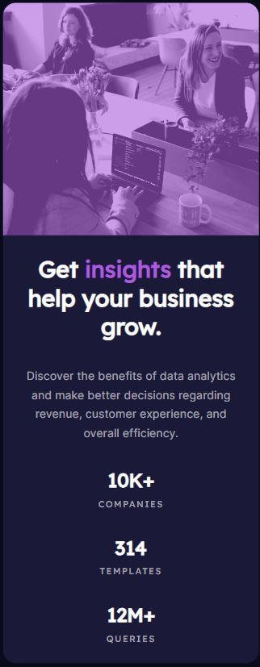

# Frontend Mentor - Stats preview card component solution
This is a solution to the [Stats preview card component challenge on Frontend Mentor](https://www.frontendmentor.io/challenges/stats-preview-card-component-8JqbgoU62). Frontend Mentor challenges help you improve your coding skills by building realistic projects. 

## Table of contents

- [Overview](#overview)
  - [The challenge](#the-challenge)
  - [Screenshot](#screenshot)
  - [Links](#links)
- [My process](#my-process)
  - [Built with](#built-with)
  - [What I learned](#what-i-learned)
  - [Continued development](#continued-development)
  - [Useful resources](#useful-resources)
- [Author](#author)

## Overview

### The challenge

Users should be able to:

- View the optimal layout depending on their device's screen size

### Screenshot

#### Desktop Layout Screenshot

#### Mobile Layout Screenshot

### Links

- [Solution page](https://github.com/UnknownBuilder/FEmentor_stats-preview-card)
- [Live site](https://unknownbuilder.github.io/FEmentor_stats-preview-card/)

## My process

### Built with

- HTML 5
- CSS Flexbox

### What I learned

At this point I've done a few of the newbie challenges and things are starting to get a little repetitive. I'm sure that the code that I write can be optimized in some way that would require much less code but at this stage I feel I need to move on to something a bit more challenging. But I wont. 

Repetition is the best teacher and before I move on to the next level of challenges I want to learn CSS Grid. I keep stating that I'll CSS Grid in these README docs but I haven't yet. The main reason, I tend to start new challenges during the week when I have to worry about my day job as an accountant. By the time I get home my brain power is about exhausted so learning something seems very challenging that I take the path of least resistance.

Going forward, I'm going to start new challenges on the weekends so I'm more inclined to learn rather than just accomplish. 

### Continued development

My next challenge will be using CSS Grid. No, ands, ifs or buts. I believe strongly that it will help out immensely in properly laying out my websites.

Working with images seems to be a challenge for me. I'm going to spend a bit more time on it on the next challenge. 

### Useful resources

At this stage, I depended a lot on the notes that I've been taking on Notion. Writting things down has saved me so much time googling finding answers to problems I've already found. 

## Author

- Frontend Mentor - [@Developing Hephaestus](https://www.frontendmentor.io/profile/UnknownBuilder)
- Github - [@Developing Hephaestus](https://github.com/UnknownBuilder)
